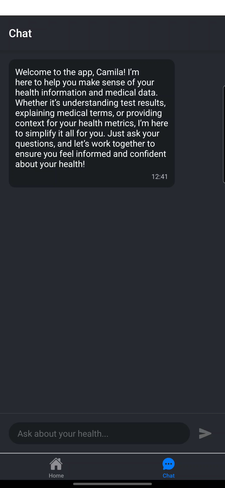
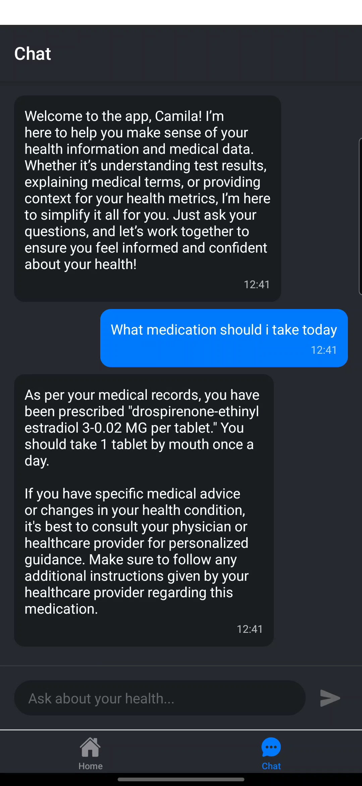
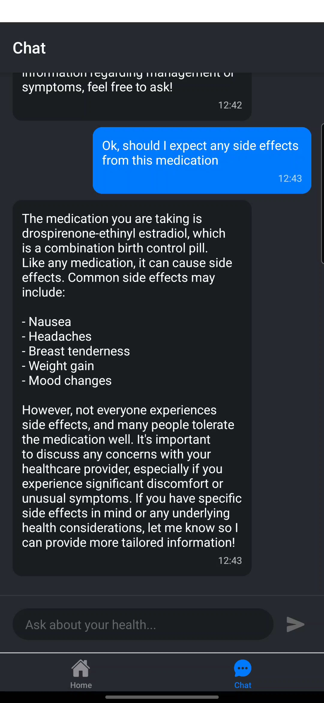

# Topology Mobile

This application demonstrates how to build a patient-facing healthcare app that can securely connect to Epic and other EMR systems through the [SMARTerFHIR toolkit](https://github.com/TopologyHealth/SMARTerFHIR).

## Demo video

<div align="center">
  <video src="https://github.com/user-attachments/assets/7fc97bb0-c0fe-4fe1-8b7f-4ba55b80a58f" />
</div>

## Key Features

- OAuth2 Authentication with Epic and other EMR systems
- Patient data retrieval and display
- View patient health information including:
- Conditions and Practitioners
  - Health goals
  - Diagnostics
  - Upcoming appointments
  - Health metrics
  - Medications
- AI-powered chat interface using OpenAI

### Application Content

The following screenshots showcase the key features of the Topology Mobile application powered by the SMARTerFHIR toolkit.

|  |  |  |
| :---------------------------------------: | :-----------------------------------------: | :----------------------------------------------: |
|                Epic Login                 |              Application Login              |               OAuth2 Authorization               |

|  |  |  |
| :------------------------------------------: | :--------------------------------------------------------: | :----------------------------------------------------------------------: |
|              Patient Dashboard               |                Dashboard (Alternative View)                |                       Health Metrics & Medications                       |

|  |  |  |
| :---------------------------------------------: | :---------------------------------------------------------: | :---------------------------------------------: |
|                AI Assistant Chat                |           AI Assistant answering about epic data            |           AI Assistant extrapolation            |

### About Topology Health

Topology Health has a set of tools for faster and easier EMR/EHR integration. https://github.com/TopologyHealth

## Get started

### Prerequisites

- [Expo CLI](https://docs.expo.dev/)
- npm or yarn
- iOS Simulator (for iOS) or Android Emulator (for Android)
- OpenAI API access via proxy (This example uses [Backmesh](https://backmesh.com))

### Install

1. Install dependencies

   ```bash
   npm install
   ```

2. Start the app

   ```bash
    npx expo start
   ```

In the output, you'll find options to open the app in a

- [development build](https://docs.expo.dev/develop/development-builds/introduction/)
- [Android emulator](https://docs.expo.dev/workflow/android-studio-emulator/)
- [iOS simulator](https://docs.expo.dev/workflow/ios-simulator/)
- [Expo Go](https://expo.dev/go), a limited sandbox for trying out app development with Expo

You can start developing by editing the files inside the **app** directory. This project uses [file-based routing](https://docs.expo.dev/router/introduction).

3. Copy the `.env.local.example` file to `.env`

   ```bash
   cp .env.local.example .env
   ```

4. Fill in the values in the `.env` file:

   ```bash
   EXPO_PUBLIC_EMR_CLIENT_ID=your_web_client_id
   EXPO_PUBLIC_REDIRECT_URL=your_app_redirect_url
   EXPO_PUBLIC_BACKMESH_URL=your_openai_proxy_url
   EXPO_PUBLIC_FIREBASE_API_KEY=your_firebase_api_key
   EXPO_PUBLIC_FIREBASE_AUTH_DOMAIN=your_firebase_auth_domain
   EXPO_PUBLIC_FIREBASE_PROJECT_ID=your_firebase_project_id
   ```

### Development Setup

The project uses ESLint, Prettier, and Husky for code quality and consistency. Install Husky pre-commit hooks:

```bash
npm run prepare
```

### Configuring Epic OAuth2

1. Create a account on https://fhir.epic.com/Developer/

2. Inside your developer view, create a new App

   1. Create two new client applications, one for web and one for native.
   2. Set the Redirect URI to `http://localhost:8081` for the web client and something like `exp://192.168.???.???:8081` for the native client.
      - Run `npm start`, run the app on your device with Expo Go, and check the "Redirect URL: ..." log message in the terminal to get the IP address to use.
   3. After creating the two new client applications, copy the client ID from both.

3. Configure environment variables.

### OpenAI Configuration

The application uses `openai-react-native` for chat functionality. As recommended by [openai-react-native](https://github.com/backmesh/openai-react-native), we use a proxy server to secure the OpenAI API key. Here's how it's configured:

```typescript
const client = new OpenAI({
  baseURL: process.env.EXPO_PUBLIC_BACKMESH_URL!,
  apiKey: await creds.user.getIdToken(), // Using Firebase auth token
});
```

⚠️ **Security Note**: Never expose your OpenAI API key directly in the mobile app. Always use a proxy server.

## Learn more

To learn more about developing your project with Expo, look at the following resources:

- [Expo documentation](https://docs.expo.dev/): Learn fundamentals, or go into advanced topics with our [guides](https://docs.expo.dev/guides).
- [Learn Expo tutorial](https://docs.expo.dev/tutorial/introduction/): Follow a step-by-step tutorial where you'll create a project that runs on Android, iOS, and the web.

## License

This project is licensed under the MIT License - see the `LICENSE.txt` file for details.

## Commercial Support

[](https://www.vintasoftware.com/)

This is an open-source project maintained by [Vinta Software](https://www.vinta.com.br/). We are always looking for exciting work! If you need any commercial support, feel free to get in touch: contact@vinta.com.br
