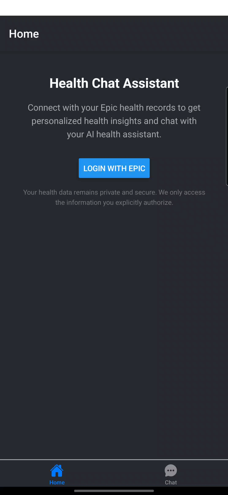

# Topology Mobile

This application demonstrates how to build a patient-facing healthcare app that can securely connect to Epic and other EMR systems through the [SMARTerFHIR toolkit](https://github.com/TopologyHealth/SMARTerFHIR).

## Key Features

- SMART on FHIR authentication with Epic and other EMR systems
- Patient data retrieval and display
- View patient health information including:
  - Conditions and practitioners
  - Health goals
  - Diagnostics
  - Upcoming appointments
  - Health metrics
  - Medications

## Application Content

The following screenshots showcase the key features of the Topology Mobile application powered by the SMARTerFHIR toolkit.

|  |  |  |
| :---------------------------------------: | :-----------------------------------------: | :----------------------------------------------: |
|                Epic Login                 |              Application Login              |               OAuth2 Authorization               |

|  |  |  |
| :------------------------------------------: | :--------------------------------------------------------: | :----------------------------------------------------------------------: |
|              Patient Dashboard               |                Dashboard (Alternative View)                |                       Health Metrics & Medications                       |

## Get started

1. Install dependencies

   ```bash
   npm install
   ```

2. Start the app

   ```bash
    npx expo start
   ```

In the output, you'll find options to open the app in a

- [development build](https://docs.expo.dev/develop/development-builds/introduction/)
- [Android emulator](https://docs.expo.dev/workflow/android-studio-emulator/)
- [iOS simulator](https://docs.expo.dev/workflow/ios-simulator/)
- [Expo Go](https://expo.dev/go), a limited sandbox for trying out app development with Expo

You can start developing by editing the files inside the **app** directory. This project uses [file-based routing](https://docs.expo.dev/router/introduction).

## Learn more

To learn more about developing your project with Expo, look at the following resources:

- [Expo documentation](https://docs.expo.dev/): Learn fundamentals, or go into advanced topics with our [guides](https://docs.expo.dev/guides).
- [Learn Expo tutorial](https://docs.expo.dev/tutorial/introduction/): Follow a step-by-step tutorial where you'll create a project that runs on Android, iOS, and the web.
